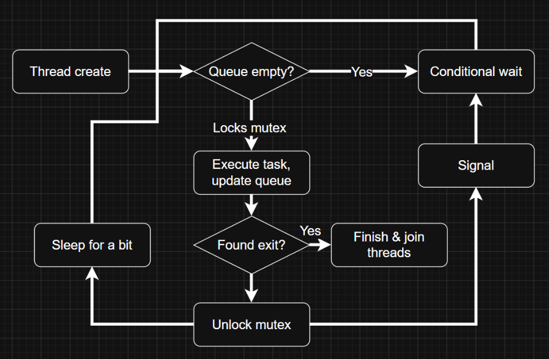

# Concurrent Maze Solver

**Alberto Verrilli and Đặng Đức An**

---

## Table of Contents

1. [Product Overview](#1-product-overview)
2. [How It Works](#2-how-it-works)
   - [Maze Generation](#a-maze-generation)
   - [Concurrent Solving](#b-concurrent-solving)
3. [How to Install](#3-how-to-install-the-program)
4. [How to Use](#4-how-to-use-the-program)

---

## 1. Product Overview

Our product is a terminal based concurrent maze solver that visualizes concurrency by using a multi-threaded maze solving algorithm. The main idea behind this product was to illustrate how an operating system can utilize multiple threads working on the same data at the same time.

In the visualization each thread is given a unique color. As a thread claims a cell and checks its surroundings the map is redrawn in the terminal with that thread's color indicating its location. When the exit cell is found the program stops, traces back the shortest path via the BFS distance values and the path is animated across the screen.

---

## 2. How It Works

### a. Maze Generation

A perfect maze is a maze that only has 1 unique path between any 2 cells. A perfect maze is created using backtracking: start with any random cell, randomly explore a neighbor cell by removing the wall in between and mark as visited. When there are no unvisited cells around, backtracks from there. Continue until all cells are visited.

An imperfect maze is a perfect maze with some random walls being removed to introduce loops. In the program, it is created by iterating through all walls and each will have a 10% chance of being removed.

The maze itself is a grid of `Cell` structs that store its wall data with pointers to navigable neighbors. Mazes are generated using a depth-first search algorithm, which produces a perfect maze with one solution. There is also an option to create an imperfect maze which randomly removes additional walls to create multiple valid paths.

---

### b. Concurrent Solving

The maze is solved using threadpool, one of the multithreaded programming techniques. The threadpool algorithm requires the following components:

- **Posix Threads**
- **Mutex** — lock that protects shared resources
- **Condition Variables** — allows threads to sleep when the queue is empty
- **Volatile flag** — shared boolean that stops all threads once the exit cell is reached

With the goal of finding the shortest path between a known starting point and an unknown exit, we use a BFS approach to solve the maze:

- Add the starting node to a queue
- A thread wakes up and grabs the node from the queue
- Find the adjacent cells to the node and add them back to the queue
- The thread sleeps for a fixed duration (it pretends to be busy to slow down solving animation)

While one thread is sleeping, multithreaded programming allows other threads to keep executing the solving tasks. Therefore the solving speed reduces as the number of threads increases.

**Thread's lifecycle:**



---

## 3. How to Install the Program

Our program is written in C and only works on POSIX compliant systems like Linux or macOS. It requires GCC to compile the main file, pthreads library, and access to a terminal.

Simply clone the github repo with `git clone`, then compile from the `src` directory with:

```bash
git clone https://github.com/ducanup01/Concurrent-Maze-Solver.git
```
```bash
cd Concurrent-Maze-Solver && gcc src/main.c src/maze.c src/stack.c src/linkedListQueue.c -o main -lpthread
```

---

## 4. How to Use the Program

Run the compiled binary using:

```bash
./main
```

An interactive menu will appear in the terminal. Use the arrow keys to navigate and `Enter` to select. The options are:

- Randomize Maze
- Random imperfect Maze
- Load Maze
- Exit

After you create a maze you are prompted if you would like to save it to a binary file to be loaded later. After that you will be prompted to choose the number of threads you would like to solve the maze. The program will run until a thread reaches the exit cell marked with `E` in red. Then the shortest path will be traced in red. Once finished the program will print the total solve time and the shortest distance from start to finish:

```
Time taken: 0s 412ms 331us 0ns
Distance from start: 47 tiles
```
